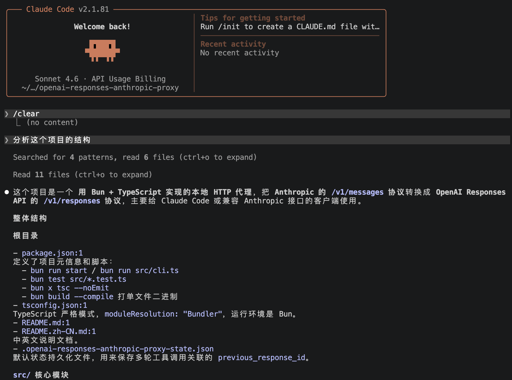

# OpenAI Responses Anthropic Proxy

一个独立运行的本地 HTTP 代理。

它对外暴露 Anthropic 兼容的 `POST /v1/messages` 接口，让 Claude Code 可以像连接 Anthropic 一样连接它；代理内部再把请求转发到 OpenAI Responses API，或者兼容 Responses API 的第三方服务商。

## 功能概览

- 接收 Anthropic 风格的 `POST /v1/messages`
- 转发到 OpenAI 风格的 `POST /v1/responses`
- 支持非流式响应
- 支持流式文本响应
- 支持工具调用转换为 Anthropic `tool_use`
- 支持工具结果续接与 `previous_response_id`
- 支持 OpenAI 官方 Responses API
- 支持兼容 Responses API 的 OpenAI-compatible 服务商
- 每次请求输出一条结构化访问日志，方便排查 Claude Code 是否真的走了代理

## 运行要求

- Bun `>= 1.3`

## 快速开始

1. 安装依赖：

```bash
bun install
```

2. 复制环境变量模板：

```bash
cp .env.example .env
```

3. 按需修改 `.env` 中的上游配置。

4. 启动代理：

```bash
set -a
source .env
set +a
bun run start
```

你也可以不用 `.env`，直接通过命令行传参：

```bash
bun run start -- \
  --listen-port 4141 \
  --upstream-url https://api.openai.com \
  --upstream-key "$OPENAI_API_KEY" \
  --upstream-model gpt-4.1 \
  --state-file .openai-responses-anthropic-proxy-state.json
```

## 给 Claude Code 使用

启动代理后，把 Claude Code 指到本地代理：

```bash
export ANTHROPIC_BASE_URL=http://127.0.0.1:4141
export ANTHROPIC_API_KEY=dummy
```

这里的 `dummy` 只是占位。Claude Code 需要这个变量非空，但真正访问上游的密钥由代理自己的 `.env` 或命令行参数提供。

代理默认会把工具续接状态持久化到
`.openai-responses-anthropic-proxy-state.json`，这样重启后还能继续使用
`previous_response_id`。如果要自定义位置，可以设置
`OPENAI_RESPONSES_STATE_FILE` 或 `--state-file`。

## 日志

代理会对每次 `POST /v1/messages` 输出一条结构化日志：

```text
[openai-responses-proxy] request {"ts":"2026-04-06T03:06:30.090Z","method":"POST","path":"/v1/messages","model":"claude-sonnet-test","stream":true,"status":200,"upstream_status":200,"duration_ms":1209,"error":null}
```

你可以通过日志确认：

- Claude Code 是否真的走了这个代理
- 当前请求是否是流式
- 上游是否成功返回
- 整体耗时大概多少

## 正常使用截图

下面这张图是一次真实的 Claude Code 会话，提示词为
`分析这个项目的结构`。它通过这个代理正常返回了结构化分析结果，而不是
工具续接错误：



## 环境变量

- `OPENAI_RESPONSES_PROXY_HOST`
- `OPENAI_RESPONSES_PROXY_PORT`
- `OPENAI_RESPONSES_UPSTREAM_URL`
- `OPENAI_RESPONSES_UPSTREAM_KEY`
- `OPENAI_RESPONSES_UPSTREAM_MODEL`
- `OPENAI_RESPONSES_STATE_FILE`

## Docker 使用

构建镜像：

```bash
docker build -t openai-responses-anthropic-proxy .
```

运行镜像：

```bash
docker run --rm \
  -p 4141:4141 \
  -e OPENAI_RESPONSES_PROXY_HOST=0.0.0.0 \
  -e OPENAI_RESPONSES_PROXY_PORT=4141 \
  -e OPENAI_RESPONSES_UPSTREAM_URL=https://api.openai.com \
  -e OPENAI_RESPONSES_UPSTREAM_KEY="$OPENAI_API_KEY" \
  -e OPENAI_RESPONSES_UPSTREAM_MODEL=gpt-4.1 \
  openai-responses-anthropic-proxy
```

## 构建单文件可执行程序

```bash
bun run build:binary
```

生成结果在：

```text
dist/openai-responses-anthropic-proxy
```

## 开发命令

```bash
bun run test
bun run typecheck
```

## 目录结构

```text
src/cli.ts
src/server.ts
src/translate.ts
src/state.ts
src/config.ts
src/types.ts
```
